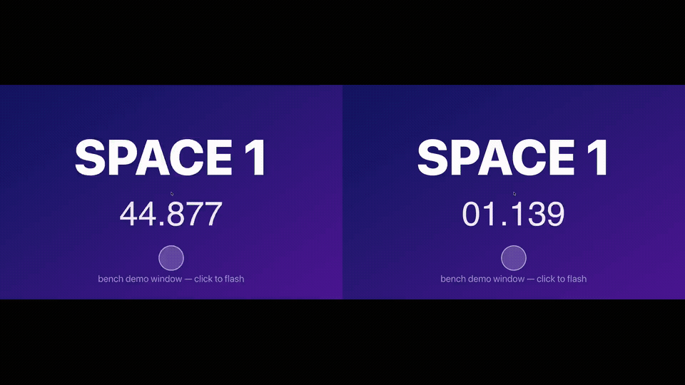

# strafe

When you swipe between macOS Spaces with three fingers, the system plays a
slide animation and queues your input until the transition finishes — roughly
half a second of dead time on every switch, during which clicks and keystrokes
go nowhere. strafe removes that dead time. It intercepts the swipe and jumps
straight to the neighboring Space, so the switch is instant and the new Space is
interactive immediately.

It runs as a menu-bar accessory (no Dock icon), works with your normal 3-finger
swipe, and adds keyboard shortcuts and a small CLI.

## See it



Same machine, same synthetic swipe — the only difference is velocity profile.
Measured medians: **~160 ms** to interactive natively vs **~42 ms** with strafe
(MacBook Pro, Apple M3 Pro, macOS 26.3 — [full video](docs/media/demo.mp4)).
The numbers are reproducible with the [bench harness](bench/), which documents
the methodology and its caveats honestly.

## Have your agent set it up

Copy this into Claude Code (or any coding agent) and it will handle everything
except the one click macOS reserves for you:

```text
Set up strafe (https://github.com/rileycx/strafe), a macOS utility that makes
Space switching instant. Steps:

1. Clone the repo and read SECURITY.md, then skim the source (~1,100 lines,
   no dependencies) and confirm the claims hold: the event tap mask covers
   only gesture events, and there is no network, subprocess, or file-write
   code. Tell me what you found before proceeding.
2. Run ./Scripts/bundle.sh and move build/strafe.app to /Applications.
3. Launch it, then open System Settings > Privacy & Security > Accessibility
   so I can grant it permission. Remove any stale strafe entries first.
4. Wait for me to confirm I granted it, then quit strafe from the menu-bar
   icon and relaunch it — the event tap is only created at launch, so the
   grant does nothing until the app restarts.
5. Have me test a 3-finger swipe between Spaces. It should be instant.
```

The audit step is not decoration: strafe asks for Accessibility, so make your
agent verify the code before you run it. It's small enough that it actually can.

## Credit

The instant space-switching technique strafe uses — synthesizing a
high-velocity Dock-swipe `CGEvent` with near-zero progress, and intercepting
your real trackpad swipe with an active event tap — was invented and first
implemented by **jurplel** in
[InstantSpaceSwitcher](https://github.com/jurplel/InstantSpaceSwitcher) (MIT).
The concept and the original implementation are entirely jurplel's work. strafe
is an independent reimplementation of that idea; if you want the original, go
give InstantSpaceSwitcher a star. See [LICENSE](LICENSE) for the full
acknowledgment and their copyright notice.

## Install

strafe is distributed as source only — there is no prebuilt binary to trust.
You build the code you can read.

```bash
git clone https://github.com/rileycx/strafe strafe && cd strafe
./Scripts/bundle.sh
```

This builds a release binary and assembles `build/strafe.app` (ad-hoc signed).
Then:

1. Drag `build/strafe.app` to `/Applications`.
2. Launch it. It will prompt for Accessibility permission.
3. Grant it in **System Settings › Privacy & Security › Accessibility**.

The app is about 1,080 lines of Swift and C with no third-party dependencies —
`swift build` finishes in seconds and you can read the whole thing. See
[SECURITY.md](SECURITY.md).


## Usage

- **3-finger swipe** — just works once strafe is running and has Accessibility.
  Swipe left/right between Spaces and the switch is instant.
- **Keyboard** — `ctrl`+`opt`+`←` and `ctrl`+`opt`+`→` switch Spaces.
- **Menu bar** — click the strafe icon to enable/disable interception or check
  whether Accessibility has been granted.
- **CLI:**

  ```
  strafe switch left|right   # switch once and exit
  strafe status              # print accessibility / tap status
  strafe                     # start the menu-bar app
  ```

## Permissions

strafe needs **Accessibility** permission, and only that. macOS requires it to
create an *active* event tap — the kind that can suppress the slow animated
swipe and replace it with the instant one.

The tap sees only trackpad gesture and dock-control events. It does **not** see
keystrokes: the event mask excludes key events entirely, and strafe has no
network, telemetry, file access, or subprocess code. Every one of those claims
is grep-verifiable — see [SECURITY.md](SECURITY.md) for the exact file and line
pointers.

To revoke: **System Settings › Privacy & Security › Accessibility**, and toggle
strafe off (or remove it from the list).

## Uninstall

1. Quit strafe from its menu-bar menu.
2. Delete `strafe.app`.
3. Remove its entry from **System Settings › Privacy & Security ›
   Accessibility**.

That's everything. strafe writes no preferences, caches, or other files — there
is nothing else to clean up.

## How it works

macOS generates a "Dock swipe" event for a real 3-finger horizontal swipe.
strafe posts a synthetic one with an artificially near-zero *progress* and a
very high *velocity*. The high velocity makes the WindowServer treat the gesture
as a flick and skip the slide animation, jumping instantly to the neighboring
Space. At the same time an active event tap suppresses your real swipe so the OS
never runs its own animated version. For the field-by-field derivation, read
[docs/SPEC.md](docs/SPEC.md).

## Requirements

- macOS 15 or newer
- Apple Silicon (that is what strafe is built and tested on)

## License

MIT — Copyright (c) 2026 Riley Hennigh. See [LICENSE](LICENSE), which also
carries the acknowledgment and MIT notice for jurplel's InstantSpaceSwitcher.
